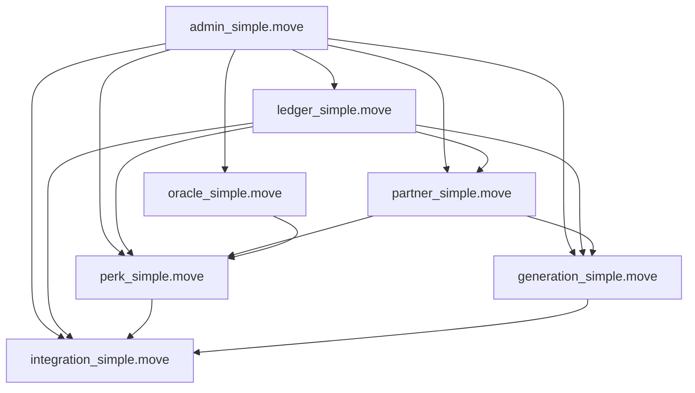

# Core Module Dependency Analysis

## 🔗 Module Interaction Map



## 📋 Dependency Matrix

| Module | admin | ledger | partner | oracle | perk | generation | integration |
|--------|-------|--------|---------|--------|------|------------|-------------|
| **admin_simple** | - | ✅ | ✅ | ✅ | ✅ | ✅ | ✅ |
| **ledger_simple** | ✅ | - | ❌ | ❌ | ❌ | ❌ | ❌ |
| **partner_simple** | ✅ | ✅ | - | ❌ | ❌ | ❌ | ❌ |
| **oracle_simple** | ✅ | ❌ | ❌ | - | ❌ | ❌ | ❌ |
| **perk_simple** | ✅ | ✅ | ✅ | ✅ | - | ❌ | ❌ |
| **generation_simple** | ✅ | ✅ | ✅ | ❌ | ❌ | - | ❌ |
| **integration_simple** | ✅ | ✅ | ❌ | ✅ | Optional | Optional | - |

## 🎯 Core Business Flow Dependencies

### 1. **Partner Onboarding Flow**
```
admin_simple (config) 
→ partner_simple (create vault + capability)
→ ledger_simple (quota allocation)
```

### 2. **Point Minting Flow** 
```
generation_simple (action execution)
→ partner_simple (quota validation)
→ ledger_simple (mint points)
→ admin_simple (pause checks)
```

### 3. **Perk Creation Flow**
```
perk_simple (create perk)
→ partner_simple (vault validation)
→ oracle_simple (price feeds)
→ admin_simple (treasury address)
```

### 4. **Perk Redemption Flow**
```
perk_simple (claim perk)
→ ledger_simple (burn points)
→ partner_simple (USDC distribution)
→ oracle_simple (price validation)
```

### 5. **User Redemption Flow**
```
integration_simple (redeem points)
→ ledger_simple (burn points)
→ oracle_simple (price conversion)
→ admin_simple (treasury USDC)
```

## 🔄 Critical Function Dependencies

### **admin_simple.move exports:**
- `get_points_per_usd()` → Used by partner_simple, perk_simple
- `get_treasury_address()` → Used by perk_simple, integration_simple
- `assert_not_paused()` → Used by ALL modules
- `is_admin()` → Used by ALL admin functions

### **ledger_simple.move exports:**
- `mint_points()` → Used by partner_simple, generation_simple
- `burn_points()` → Used by perk_simple, integration_simple
- `get_balance()` → Used by perk_simple, integration_simple

### **partner_simple.move exports:**
- `create_partner_and_vault()` → Used by generation_simple
- `mint_points_against_quota()` → Used by generation_simple
- `get_vault_info()` → Used by perk_simple

### **oracle_simple.move exports:**
- `get_price()` → Used by perk_simple, integration_simple
- `is_price_fresh()` → Used by perk_simple

## 🛡️ Security Dependencies

### **Critical Security Chains:**
1. **Financial Security**: admin_simple → partner_simple → ledger_simple
2. **Access Control**: admin_simple → ALL modules
3. **Economic Integrity**: oracle_simple → perk_simple → ledger_simple
4. **Quota Enforcement**: partner_simple → generation_simple → ledger_simple

### **Emergency Controls:**
- admin_simple.emergency_pause → Affects ALL modules
- Each module checks pause state before critical operations
- No circular dependencies in emergency shutdown

## ⚡ Compilation Order

1. **admin_simple.move** (no dependencies)
2. **ledger_simple.move** (depends on admin_simple)
3. **oracle_simple.move** (depends on admin_simple)
4. **partner_simple.move** (depends on admin_simple, ledger_simple)
5. **perk_simple.move** (depends on admin_simple, ledger_simple, partner_simple, oracle_simple)
6. **generation_simple.move** (depends on admin_simple, ledger_simple, partner_simple)
7. **integration_simple.move** (depends on admin_simple, ledger_simple, oracle_simple)

## 🎯 Audit Priority by Dependency Impact

1. **admin_simple** - Affects ALL modules (highest impact)
2. **ledger_simple** - Core financial operations (high impact)
3. **partner_simple** - USDC backing logic (high impact)
4. **oracle_simple** - Price integrity (medium impact)
5. **perk_simple** - Revenue distribution (medium impact)
6. **generation_simple** - Integration endpoints (medium impact)
7. **integration_simple** - User endpoints (lowest impact)
